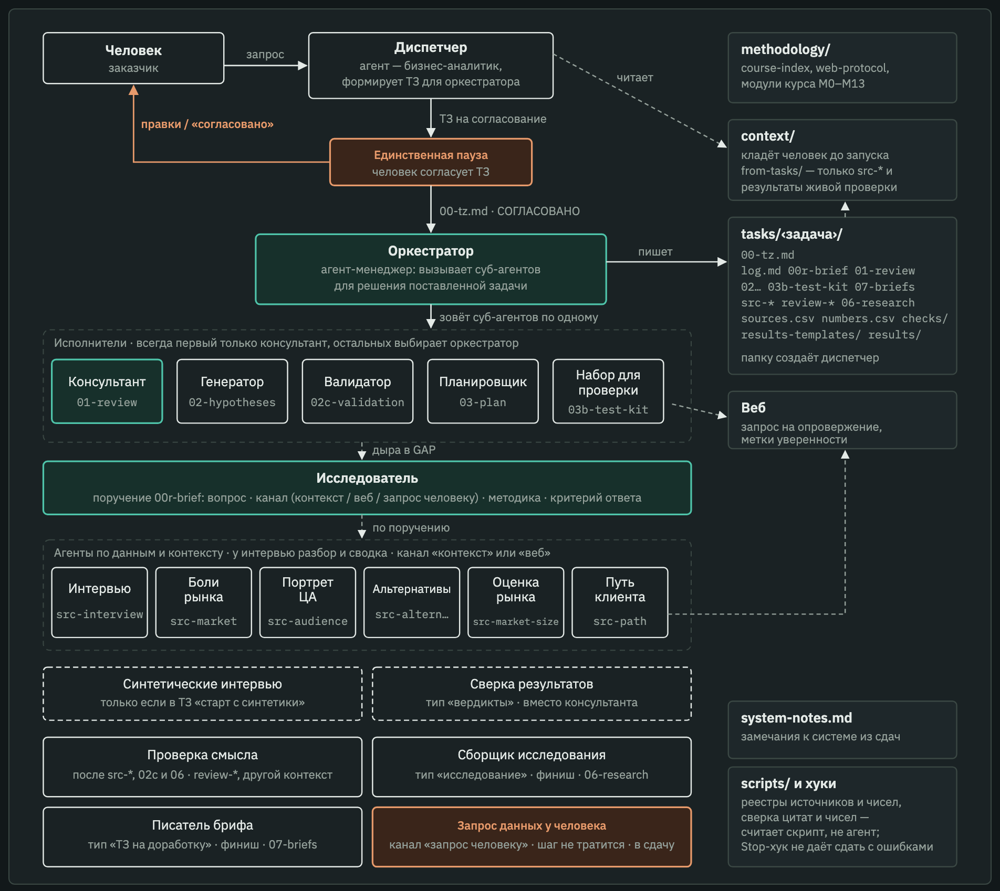
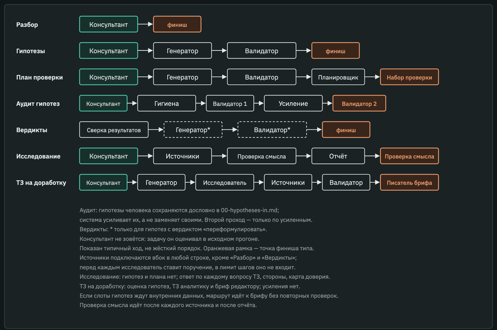
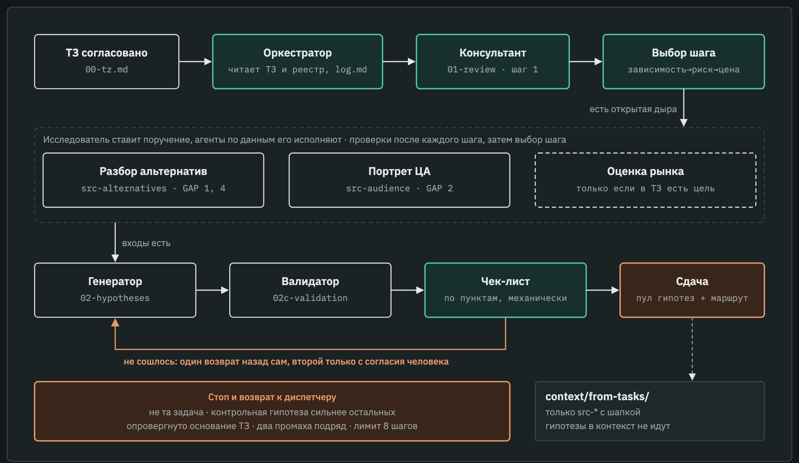

# Полигон гипотез

Система скиллов. Берёт сырой запрос по продукту или маркетингу и ведёт его до одного из семи результатов: разбор, проверенные на бумаге гипотезы, план живой проверки с готовыми материалами, вердикты по итогам проверки, аудит собственных гипотез, исследование или ТЗ на доработку — документы, с которыми можно сразу идти к аналитику и редактору. Идеи сверяются с контекстом продукта, рынка и историей проекта, на веру ничего не принимается. Цитаты, числа и права записи проверяют скрипты и хуки, а не исполнитель.

Подробно — в документах «Полигон гипотез: описание проекта» и «Система скиллов: спецификация».

## Архитектура

> Схемы — снимки `docs/architecture.html`, где есть и подписи, и принципы; файл открывается в браузере локально. После изменений в системе сначала правится HTML, потом с него заново снимаются PNG.

## Что внутри

- `AGENTS.md` — инструкции для агента: роли, принципы, правила. Единственный источник правды.
- `CLAUDE.md` — одна строка `@AGENTS.md`: Claude Code читает только свой файл.
- `.claude/skills/` — девятнадцать скиллов. Реестр контрактов — `.claude/skills/orchestrator/registry.md`.
- `methodology/` — указатель GTM-курса, модули курса, протокол работы с вебом.
- `context/` — контекст проекта: материалы о продукте и клиентах.
- `tasks/` — задачи; папки создаёт система.
- Содержимое `context/` и `tasks/` в git не попадает. Материалы остаются у того, кто их положил.
- `scripts/` — проверки, которые не зависят от честности агента; список и назначение — в разделе «Проверки» ниже. `scripts/hooks/` и `.claude/settings.json` — хуки Claude Code.
- `system-notes.md` — журнал замечаний к системе.

## Кто что делает

| Роль | Задача |
| --- | --- |
| Диспетчер | Превращает запрос в ТЗ: что человек хочет получить, чего не хватает, какой тип выхода. Скиллы не выбирает |
| Человек | Согласует ТЗ. Это единственная пауза в системе |
| Оркестратор | После каждого шага решает, кого звать дальше, и ведёт лог. Консультант всегда идёт первым |
| Исполнители | Консультант, генератор гипотез, проверка по сути, планировщик, набор для проверки, семь источников данных, проверка смысла, сборщик исследования, писатель брифа, синтетика, сверка результатов |

Источники данных — не этап, а ход по выбору: оркестратор зовёт их, только когда без ответа гипотезы или вердикт будут догадкой. Если ответ лежит внутри компании (воронка, выгрузка, результат аналитической задачи), система не идёт в веб: оркестратор пишет запрос аналитику, и тот попадает в сдачу отдельным блоком. Шаг бюджета на это не тратится.

## Типы выхода

Тип выбирает диспетчер по запросу, а ты согласуешь его в ТЗ.

| Тип | Когда | Чем заканчивается |
| --- | --- | --- |
| Разбор | нужна оценка идеи или постановки | разбор консультанта |
| Гипотезы | нужно понять, что делать | проверенные на бумаге гипотезы и итоговая позиция: на что ставить и с чего начать |
| План проверки | нужно довести до действий | план и набор материалов |
| Вердикты по проверке | принёс результаты живой проверки | вердикты по плану прошлой задачи |
| Валидация | принёс свою идею или гипотезы: «провалидируй» | документ `06-validation.md`: вердикт по идее, утверждения с «за» и «против» из контекста и сети, что не так, где слабо и как усилить, как проверить, карта доверия |
| Исследование | нужно понять, что известно, без выбора решения: «собери исследование» | отчёт `06-research.md`: ответ по каждому вопросу, основания, стороны, карта доверия |
| ТЗ на доработку | нужно оценить идеи и наполнить их конкретикой: «составь ТЗ аналитику и редактору» | три коротких документа без языка системы: задача аналитику (`07a-analyst.md`), бриф редактору со словами клиентов (`07b-editor.md`), список решений за тобой (`07c-decisions.md`); порядок направлений — по итоговой позиции консультанта (`02e-position.md`) |

В ТЗ ключевые пункты GAP помечены `[ключевой]`: по ним система ищет глубже, а слабая опора попадает в начало карты доверия. Решение, которое ты назвал принятым, получает пометку `[принято]`, и система его не оспаривает, только проверяет допущения внутри.

## Проверки

Что можно проверить скриптом, проверяет скрипт. Оркестратор запускает их после каждого шага одной командой — `check_step.py`. Проверка смысла (отдельный подагент) идёт там, где стоит итог, — после проверки по сути и после итогового исследования, — и на источнике по главному вопросу. Перед окончанием ответа Stop-хук прогоняет цитаты и числа ещё раз и один раз не даёт закончить, если нашлись ошибки.

| Скрипт | Что делает |
| --- | --- |
| `add_source.py` | регистрирует источник задачи в `sources.csv`, сохраняет сырой текст; страницу скачивает сам (`--fetch`) |
| `check_quotes.py` | цитата «…» [F-id] должна найтись в сыром тексте именно своего источника; считает независимые корни; замечает цитаты без id, ссылки вне реестра, опору на утверждения команды |
| `add_number.py` | регистрирует число в `numbers.csv`: факт — с фрагментом в источнике, производное — только формулой с пересчётом, допущение — с причиной |
| `check_numbers.py` | число рядом со ссылкой [N-id]; разные значения при одинаковых условиях — противоречие, при разных — нет |
| `check_artifact.py` | артефакт шага не пуст и не заменён резюме; исполнитель не тронул чужие файлы; на блокирующие замечания проверки смысла есть ответы; блок счёта опор перенесён дословно |
| `list_unused.py` | источники, найденные на шаге, но не процитированные: вход для проверки смысла |
| `trust_map.py` | счёт опор для карты доверия исследования |
| `review_format.py` | общий разбор отчёта проверки смысла и ответов автора: им пользуются `check_artifact.py` и `trust_map.py`, счёт не расходится |
| `check_private.py` | персональные данные (имена из `private.txt`, телефоны, e-mail, ИНН, карты) в артефактах и в логе; закрытые для веба слова из `closed-web.txt` (партнёры, акции) в журналах запросов; найденное в отчёт не копируется |
| `check_step.py` | все проверки после шага одной командой: `check_artifact`, `check_quotes`, `check_private`, `check_numbers`; одна строка для лога со счётчиками (цитаты, без id, источники, независимые корни), подробности — только по ошибкам |
| `check_log_sources.py` | у каждого шага-источника в логе есть «Вопрос», «Зачем» и «Уже известно»: источник поставлен, а не взят для полноты |
| `check_readable.py` | документы писателя брифа читаются людьми: в них нет номеров гипотез, id источников и слов системы, соблюдены лимиты размера, цитаты редактору есть в служебном файле; брифы под чужим именем или их отсутствие при типе «ТЗ на доработку» — ошибка |
| `check_publish.py` | перед отправкой на GitHub ищет в файлах и сообщениях коммитов слова из `tasks/*/private.txt`, `tasks/*/closed-web.txt` и `.publish-stopwords`; найдено — отправка останавливается. Хук: `git config core.hooksPath scripts/git-hooks` |
| `hooks/guard_writes.py` | хук: подагентам закрыта запись в систему, реестр и `context/` |
| `hooks/stop_check.py` | хук: проверка цитат и чисел перед окончанием ответа |
| `selftest.py` | самопроверка всех скриптов; запускать после любой правки в `scripts/` |

Чтобы править саму систему при включённых хуках, создай в корне пустой файл `.polygon-dev` и удали его после правок.

## Чтение файлов

`add_source.py` читает `.docx`, `.xlsx`, `.pptx`, `.pdf`, текст и страницы по адресу. С PDF помогают необязательные пакеты из `requirements.txt` (`pip install -r requirements.txt`): PyMuPDF и pypdf читают текст, PyMuPDF ещё выгружает страницы в картинки. Слайды-картинки и сканы без текстового слоя скрипт отклоняет с подсказкой: `scripts/pdf_to_images.py` сохраняет страницы, агент читает их и передаёт расшифровку с `--read partial`. Что установлено, показывает `python3 scripts/check_env.py`.

## Где запускать

| Среда | Инструкции | Скиллы |
| --- | --- | --- |
| Claude Code | `CLAUDE.md` → `AGENTS.md` | находит в `.claude/skills/` сам |
| OpenCode | `AGENTS.md` | находит в `.claude/skills/` сам |
| Codex, Cursor и другие | `AGENTS.md` | если среда не нашла скиллы — `AGENTS.md` велит читать их по пути напрямую |

Систему писали под Claude. На других моделях она работает, но результат зависит от того, справляется ли модель с длинными инструкциями. Правило «кто строит, тот не проверяет» полностью выполняется только в средах с подагентами.

## Как начать

0. Открой Claude Code в корне проекта, где лежит `AGENTS.md`: хуки и скиллы подгружаются оттуда. Если сменил папку посреди сессии, открой новую.
1. Положи в `context/` что есть о продукте и клиентах — что именно, написано в `context/README.md`.
2. `/dispatcher` и задача — или «диспетчер, …», если в среде нет слеш-команд.
3. Согласуй ТЗ. Проверь тип выхода, пункты `[ключевой]`, расхождения в контексте и строку ПОЗИЦИЯ. Дальше система идёт сама до сдачи.
4. После живой проверки возьми заготовки из `tasks/<задача>/results-templates/`, заполни и положи в `tasks/<задача>/results/`, потом напиши диспетчеру.
5. Запросы данных из сдачи отдай аналитику, ответ положи в `context/` и напиши диспетчеру: он пересоберёт ТЗ.
